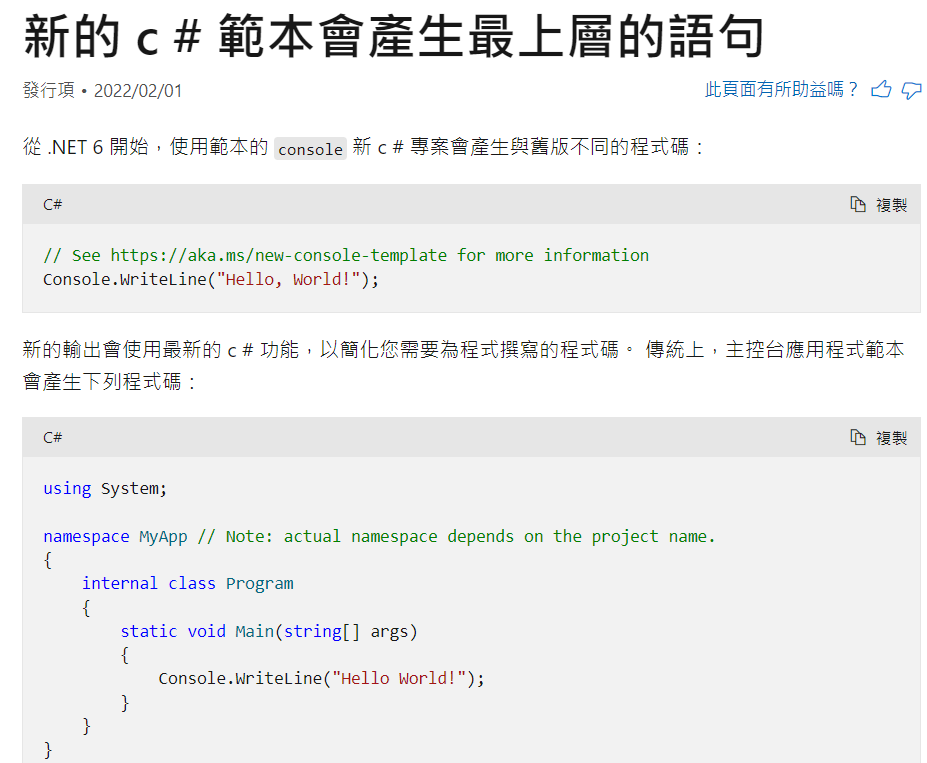

# C# 10 的全域引用

本文要介紹 C# 10 新增的全域引用（global using）命名空間的語法，同時也會提及 .NET 6 SDK 的相關功能：隱含式全域引用（implicit global using）。

工具使用： Visual Studio 2022、.NET 6 SDK

---

當我們在 Visual Studio 中建立一個新的 Console 應用程式專案，目標框架選擇 .NET 6，並採用預設的專案名稱 ConsoleApp1，專案建立完成後，可以看到 Program.cs 檔案裡面只有一行程式碼，外加一行註解：
 
    // See https://aka.ms/new-console-template for more information
    Console.WriteLine("Hello, World!");

如果點開註解當中的那條網址，會帶我們到一份微軟文件，而該文件的中文版標題是「新的 c # 範本會產生最上層的語句」，如下圖：
 

 
如果你還沒有在專案中使用 C# 10 新增的 using 語法，不妨把那篇文章從頭到尾瀏覽一遍，以大致了解有哪些方便的 using 語法。底下僅整理幾個重點，希望有助於快速掌握其用法。
 
首先，程式裡面直接寫 `Console.WriteLine(...)` 而沒有 using System 命名空間，這是使用了 .NET 6 SDK 的「隱含引用」（implicit using）功能。那麼，這些隱含引用的命名空間是隱藏在哪裡呢？

當專案編譯之後，我們可以在專案目錄下的「obj\Debug\目標框架\」目錄下找到隱含引用的檔案，名稱是 [專案名稱].GlobalUsings.g.cs。如下圖：
 

 
開啟這個 .GlobalUsings.g.cs 檔案，其內容如下：
 
    // <auto-generated/>
    global using global::System;
    global using global::System.Collections.Generic;
    global using global::System.IO;
    global using global::System.Linq;
    global using global::System.Net.Http;
    global using global::System.Threading;
    global using global::System.Threading.Tasks;

每行程式碼開頭的 `global using` 是 C# 10 新增的全域引用語法，而上面的程式片段裡面總共有七個全域引用的命名空間，這表示不僅 `Console` 類別，包含 `File`、`HttpClient`、`Thread` 等類別也都不用在其他 .cs 檔案中引用對應的命名空間，即可直接使用。如此一來，便可節省一些重複打字的時間。

值得一提的是，上列程式碼片段中的 `global::` 指示詞是在告訴編譯器：其後面跟著的命名空間是全域（最上層）的命名空間，請不要解析成特定命名空間底下的子命名空間。這個指示詞並非必要，但如果碰到命名空間衝突的情形，便可以使用命名空間別名辨識符號 `::` 來解決。

剛才展示的程式片段是來自預設的 Console 專案模板，如果是其他類型的專案模板，則會看到不同的內容。例如底下是建立 Blazor Server 專案時自動產生的 .GlobalUsings.g.cs 檔案的內容：

~~~~
// <auto-generated/>
global using global::Microsoft.AspNetCore.Builder;
global using global::Microsoft.AspNetCore.Hosting;
global using global::Microsoft.AspNetCore.Http;
global using global::Microsoft.AspNetCore.Routing;
global using global::Microsoft.Extensions.Configuration;
global using global::Microsoft.Extensions.DependencyInjection;
global using global::Microsoft.Extensions.Hosting;
global using global::Microsoft.Extensions.Logging;
global using global::System;
global using global::System.Collections.Generic;
global using global::System.IO;
global using global::System.Linq;
global using global::System.Net.Http;
global using global::System.Net.Http.Json;
global using global::System.Threading;
global using global::System.Threading.Tasks;
~~~~
 
 現在我們知道了，原來隱含引用這項功能，背後其實使用了一種叫做 `global using` 的語法。那麼，我們當然也可以在自己的專案裡面「明白地」撰寫這些「隱含的」using 了。（抱歉忍不住想繞口令）
 
## global using 語法
 
`global using`（全域引用）是 C# 10 新增的語法，其用途是將指定的命名空間套用於整個專案。換言之，A 專案裡面的 `global using` 指示詞不會影響到 B 專案或其他專案。
 
前面提到的那篇微軟文章，裡面有說可以在 .csproj 裡面使用 `<ItemGroup>` 元素來增加或移除全域的命名空間。底下是一個範例：
 
~~~~
<Project Sdk="Microsoft.NET.Sdk">
    <PropertyGroup>
        <OutputType>Exe</OutputType>
        <TargetFramework>net6.0</TargetFramework>
        <ImplicitUsings>enable</ImplicitUsings>
        <Nullable>enable</Nullable>
    </PropertyGroup>
    
    <ItemGroup>
      <Using Include="MyLib.Extensions" />
      <Using Remove="System.Net.Http" />
    </ItemGroup>    
</Project>
~~~~
 
如果不喜歡在 .csproj 裡面管理全域命名空間，我們也可以一個 C# 檔案來管理。接著就來說明具體作法。
 
首先，把 .csproj 檔案中的 `<ImplicitUsings>enable</ImplicitUsings>` 整行刪除，或將其屬性值改為 disable。也就是說，不要使用 Visual Studio 專案範本所提供的那些預設的全域命名空間。值得一提的是，將此功能關閉，並不影響上述範例中的 `<ItemGroup>` 區塊裡面的 Using 設定。
 
接著在專案中加入一個 C# 檔案，通常命名為 GlobalUsings.cs。然後只要在這個檔案裡面使用 `global using` 來加入你想要套用至整個專案的命名空間就行了。參考下圖：

## 結語
 
我比較偏好使用一個 C# 檔案來管理整個專案的 `global using` 敘述，而不喜歡在 .csproj 檔案裡面編輯 XML 標籤。一旦命名空間發生衝突，或者有任何疑慮時，只要打開我建立的那個 GlobalUsings.cs 檔案，就一目瞭然了。
 
